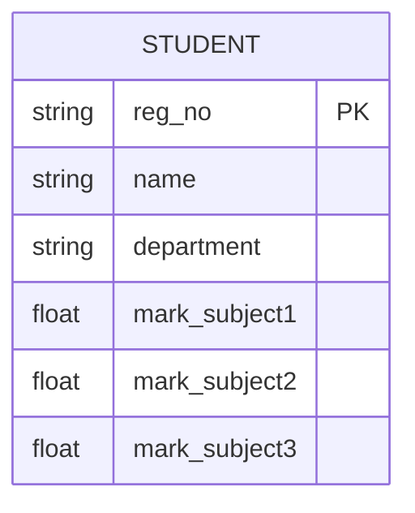
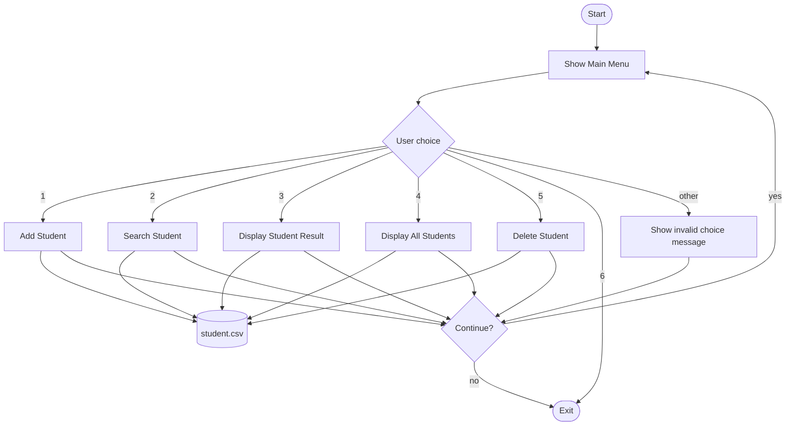
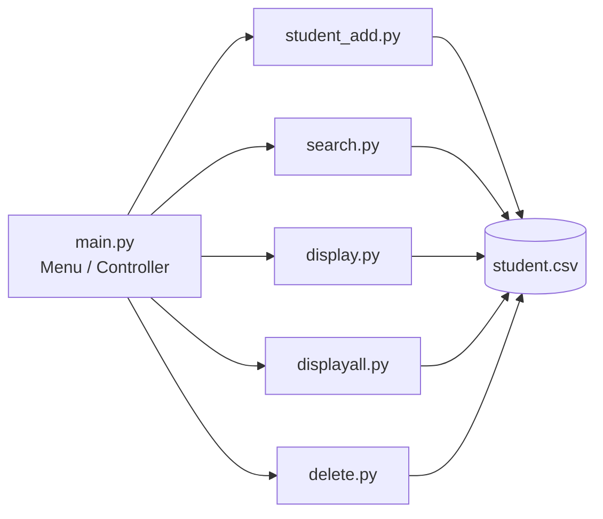

# Student Result Management System

A menu-driven, command-line application written in Python for managing student records and results. It supports adding, searching, displaying and deleting student records, and automatically computes total marks, average and Pass/Fail status. Data is stored persistently in a CSV file.

> Built as part of the **VITyarthi – Build Your Own Project** evaluation.

---

## Table of Contents

1. [Overview](#overview)
2. [Features](#features)
3. [Technologies Used](#technologies-used)
4. [Project Structure](#project-structure)
5. [Installation and Running](#installation-and-running)
6. [Usage](#usage)
7. [Data Storage Design](#data-storage-design)
8. [System Workflow](#system-workflow)
9. [Non-Functional Requirements](#non-functional-requirements)
10. [Testing Instructions](#testing-instructions)
11. [Screenshots](#screenshots)
12. [Known Limitations and Future Enhancements](#known-limitations-and-future-enhancements)

---

## Overview

Manual handling of student marks is slow and error-prone. This project provides a simple, lightweight system where an administrator or faculty member can:

- Register a student with three subject marks
- Look up a student by registration number
- View a computed result (total, average, Pass/Fail)
- View the results of every student at once
- Remove a student record

The application is split into small, single-purpose modules coordinated by a central `main.py` menu, which keeps the code easy to read and maintain.

---

## Features

| # | Module | File | Description |
|---|--------|------|-------------|
| 1 | Add Student | `student_add.py` | Accepts registration number, name, department and marks in 3 subjects. Rejects duplicate registration numbers. |
| 2 | Search Student | `search.py` | Finds a student by registration number and shows their basic details and marks. |
| 3 | Display Student Result | `display.py` | Shows a single student's total, average and Pass/Fail status. |
| 4 | Display All Students | `displayall.py` | Lists every student with marks, total, average and status. |
| 5 | Delete Student | `delete.py` | Removes a student record by registration number. |
| 6 | Exit | `main.py` | Exits the program. |

**Result logic**

- **Total** = sum of the three subject marks
- **Average** = total / 3
- **Status** = `Pass` if the student scored **40 or more in every subject**, otherwise `Fail`

**Other highlights**

- Persistent storage in `student.csv`
- Duplicate registration number detection
- Menu loop that lets the user perform several operations in one session
- Input validation on menu choices

---

## Technologies Used

- **Language:** Python 3.8+
- **Standard library modules only:**
  - `csv`: reading and writing the data file
  - `ast`: safely parsing stored records back into Python dictionaries (`ast.literal_eval`)
  - `os`: checking whether the data file is empty
- **Storage:** CSV file
- **Version control:** Git / GitHub

No third-party packages are required.

---

## Project Structure

```
student-result-management/
│
├── main.py           # Entry point – main menu and program loop
├── student_add.py    # Add a new student record
├── search.py         # Search for a student
├── display.py        # Display one student's result
├── displayall.py     # Display all students' results
├── delete.py         # Delete a student record
├── student.csv       # Data file (persistent storage)
├── README.md         # Project documentation (this file)
└── statement.md      # Problem statement, scope, target users, features
```

---

## Installation and Running

### Prerequisites

- Python 3.8 or higher installed (`python --version` to check)
- Git (optional, for cloning)

### Steps

1. **Clone the repository**
   ```bash
   git clone https://github.com/<your-username>/<your-repo-name>.git
   cd <your-repo-name>
   ```

2. **Make sure `student.csv` exists** in the project folder (an empty file is fine). It is also created automatically the first time you add a student.

3. **Run the application**
   ```bash
   python main.py
   ```

> **Important:** Run the program from inside the project folder. The modules open `student.csv` using a relative path.

---

## Usage

When the program starts, the main menu is displayed:

```
┌──────────────────────────────────────────────────────────┐
│                         MAIN MENU                        │
├──────────────────────────────────────────────────────────┤
│  1.  Add Student                                         │
│  2.  Search Student                                      │
│  3.  Display Student Result                              │
│  4.  Display All Students                                │
│  5.  Delete                                              │
│  6.  Exit                                                │
└──────────────────────────────────────────────────────────┘
Enter your choice (1-6):
```

After every operation you are asked `enter yes for continue :`. Type `yes` to return to the menu; anything else ends the program.

### Example session: adding a student

```
Enter your choice (1-6): 1
Enter Registration Number: 24BCE1001
Enter Name: Asha
Enter Department: CSE
Enter marks in Subject 1: 78
Enter marks in Subject 2: 82
Enter marks in Subject 3: 91
Student added successfully.
```

### Example session: displaying a result

```
Enter your choice (1-6): 3
Enter Registration Number: 24BCE1001

Registration Number: 24BCE1001
Department: CSE
Name: Asha
Total Marks: 251.0
Average Marks: 83.66666666666667
Status: Pass
```

---

## Data Storage Design

Records are stored in `student.csv`. Each student is one row containing a Python dictionary (written as a string), which is read back with `ast.literal_eval`.

**Record schema**

| Field | Type | Description |
|-------|------|-------------|
| `reg_no` | string | Unique registration number (acts as the primary key) |
| `name` | string | Student name |
| `department` | string | Department/branch |
| `marks` | tuple of 3 floats | Marks in Subject 1, 2 and 3 |

**Sample row in `student.csv`**

```
"{'reg_no': '24BCE1001', 'name': 'Asha', 'department': 'CSE', 'marks': (78.0, 82.0, 91.0)}"
```

**Entity-Relationship view**



---

## System Workflow



**Architecture:** `main.py` acts as the controller and imports one function from each feature module. Each module reads or writes `student.csv` independently.



---

## Non-Functional Requirements

| Requirement | How it is addressed |
|-------------|---------------------|
| **Usability** | Clear boxed menu, prompts for every input, readable output labels. |
| **Maintainability** | One feature per file; small functions; standard library only. |
| **Reliability / Data persistence** | All records are saved to `student.csv` and survive program restarts. |
| **Data integrity** | Duplicate registration numbers are rejected when adding a student. |
| **Error handling** | Invalid menu choices are handled; "student not found" and "no records found" messages are shown for missing data. |
| **Portability** | Pure Python with no external dependencies; runs on Windows, macOS and Linux. |
| **Performance / Resource efficiency** | Lightweight file-based storage suitable for small to medium class sizes. |

---

## Testing Instructions

The project is tested through manual validation test cases. Run `python main.py` and verify each case below.

| # | Test case | Steps | Expected result |
|---|-----------|-------|-----------------|
| 1 | Add a valid student | Menu 1, enter valid details | "Student added successfully." and a new row in `student.csv` |
| 2 | Duplicate registration number | Menu 1 with an existing reg. no. | "Registration number already entered" |
| 3 | Search existing student | Menu 2 with a valid reg. no. | Student's details and marks are shown |
| 4 | Search missing student | Menu 2 with an unknown reg. no. | "Student not found." |
| 5 | Pass result | Add student with all marks ≥ 40, then Menu 3 | Status: Pass |
| 6 | Fail result | Add student with any mark < 40, then Menu 3 | Status: Fail |
| 7 | Total and average | Marks 60, 70, 80, then Menu 3 | Total 210.0, Average 70.0 |
| 8 | Display all | Add 2+ students, Menu 4 | Every student is listed with total, average and status |
| 9 | Delete student | Menu 5 with a valid reg. no., then Menu 2 | Student no longer found |
| 10 | Invalid menu choice | Enter `9` or `abc` | "Invalid choice. Please enter a number from 1 to 6." |
| 11 | Exit | Menu 6 | Thank-you message and program ends |

---


**Current limitations**

- Marks input is not range-checked (for example, negative values or values above 100 are accepted), and non-numeric marks will raise an error.
- `student.csv` must be present before using Search, Display or Delete on a fresh install.
- Records are stored as dictionary strings rather than plain CSV columns.
- The number of subjects is fixed at three.

**Planned enhancements**

- Input validation for marks (0–100) and empty fields
- Update/edit student records (completing full CRUD)
- Store data as proper CSV columns or in SQLite
- Grade calculation (A/B/C) and class-level analytics (topper, class average)
- Logging of operations and unit tests using `unittest` / `pytest`
- A GUI or web front end

---

## Author

**Name:** _Your Name_
**Registration No.:** _Your Reg. No._
**Course:** _Course Name
